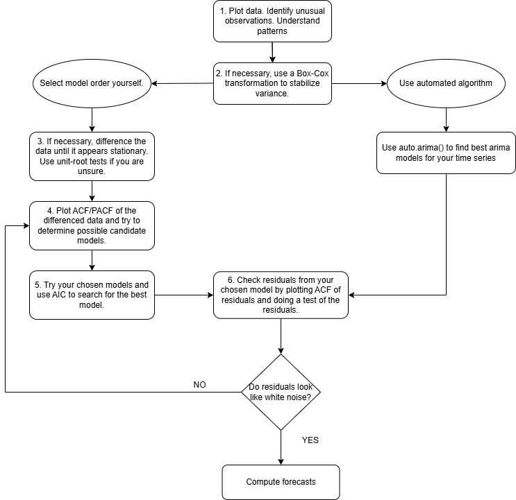

\vspace{1cm}  


In this case study we will analyze the hourly price of the electricity in the months of **August** and **September** and fit an **ARIMA** (Autoregressive Integrated Moving Average) model to forecast the prices for the following month **October** and create a set of different scenario prices.
First of all let us read the data and explore it.

Given data consists of the price each hour of the day in the SPOT market, downloaded from the E-SIOS.


# Data processing and visual exploration

```{r setup, include=FALSE}
knitr::opts_chunk$set(echo = TRUE, warning = FALSE, message = FALSE)
```

  
```{r}
# Load necessary libraries
library(forecast)
library(tseries)
library(fpp2)
library(gridExtra)
library(dplyr)
library(lubridate)
library(lmtest)
library(ggplot2)
library(reshape2)  
```


```{r}
# Replace with corresponding path
data <- read.csv("C:/Users/windows/Desktop/UC3M/4th YEAR/TFG/R/aug_sep.csv", sep=";", fileEncoding = "UTF-8")

head(data)

# Extract columns of interest:  'datetime' and 'value'
data_subset <- data[, c("datetime", "value")]

# Remove the timezone offset using gsub
data_subset$datetime <- gsub("\\+\\d{2}:\\d{2}$", "", data_subset$datetime)
data_subset$datetime <- ymd_hms(data_subset$datetime, tz = "UTC")

# Rename value col to 'price'
names(data_subset)[names(data_subset) == 'value'] <- 'price'


# Let us have a glimpse of how the series looks like.
# plot.ts(data_subset$price, ylab='Price', xlab='Observations', main='SPOT prices August & September')


# Plot using ggplot2 with weekly labels
ggplot(data_subset, aes(x = datetime, y = price)) +
  geom_line(color = "blue") +
  labs(title = "SPOT Prices August & September", x = "Date", y = "Price") +
  scale_x_datetime(date_labels = "%b-%d", date_breaks = "1 week") +  # Weekly labels
  theme_minimal()
``` 

We can see that most of August prices present a similar trend with a constant mean but for the rest, volatility is present in the time series.


Let us create the time series with the **ts** function and visualize its ACF/PACF plots.


```{r}
# Create the ts starting at first day of August
ts_data <- ts(data_subset[,2], start = c(2024, 08, 01), frequency = 24) 


# Plot time series
autoplot(ts_data) +
  labs(title = "Time Series Plot", x = "Time", y = "Price")+
  theme(axis.text.x = element_blank(),
        axis.ticks.x = element_blank())


# Plot ACF
Acf(ts_data)

# Plot PACF
Pacf(ts_data)

```


### ACF 

- ACF spikes at lags 1, 24, 48. This indicates strong seasonal autocorrelation, with a seasonality of 24 periods, which aligns with the hourly data. It suggests the presence of daily seasonality in the data, likely driven by cyclical behavior in prices across each day.

- Gradual decline (or slow decay): The ACF spikes at lags 1 and 2 suggest that there may be some short-term autocorrelation in the data. This slow decay or gradual reduction can indicate the presence of non-stationarity, which often indicates the need for differencing for instance, ARIMA with d>0.

- Spikes at lags around multiples of 24: The pattern repeats at 24, 48, 72, indicating seasonality. This is a key indication that a seasonal ARIMA model (SARIMA) is  needed, with a seasonal component based on 24-hour cycles. **ACF identifies q term**.


### PACF

- Sharp cutoff after lag 1 or 2: The PACF has a significant spike at lag 1, but little activity beyond that. This suggests that the series may be explained well by an AR(1) process, a first-order autoregressive process.

- No significant spikes after lag 1: Beyond the first lag, there's no significant partial autocorrelation, which reinforces that the non-seasonal part of the series may be well modeled with a low-order AR component. **PACF identifies p term**.


### Initial Model Assumptions:

- **Seasonality**: The clear seasonal spikes in both ACF and PACF confirm that a seasonal ARIMA model (SARIMA) would be appropriate. The period would likely be 24 to capture the daily patterns.

- **Differencing**: Based on the slow decay of the ACF and the first-lag spike in the PACF, first-order differencing  **d** (both seasonal and non-seasonal) might be needed to stabilize the mean.
AR(1) and MA(1): The PACF suggests an AR(1) process of **p** equal to **1**, while the ACF refers to a MA process, **q** equal to 1. Therefore, we could start by trying an ARIMA(1,1,1) with a seasonal component, such as SARIMA(1,1,1)(1,1,1)[24].


\newpage


# Arima model identification


Now in order to proceed with the model identification and identify the best set of parameters for the forecast we will follow the called **Box-Jenkins** metholodody which consists of the following steps:

1) Plot the series and search for possible outliers. 
2) Stabilize the variance by transforming the data (Box-Cox).
3) Analyse the stationarity of the transformed series. 
4) If the series is not stationary, then we use differencing. 
5) Identify the seasonal model by analyzing the seasonal coefficients of the ACF and PACF.
6) Identify the regular component by exploring the ACF and PACF of the residuals of the seasonal model.
7) Check the significance of the coefficients.
8) Analyze the residuals.
9) Compare different models using **AIC**.


```{r, echo=FALSE, out.width = "50%", fig.align='center'}


```


We have already did some data exploration previously but we still need to inspect if the variance is constant, due to that if the variance is not stable, the model's assumptions are violated, and thus it could led to biased forecasts.
For that we will use the **Breusch-Pagan Test** which test against **heteroskedasticity**.


### **1) Plot the series and check if variance is stationary**

```{r}
# Check if variance is constant

# Fit a linear model to check for variance 
# Create a numeric time variable
time <- seq_along(data_subset$price)

# Linear model
model <- lm(price ~ time, data = data_subset)


# Test for heteroscedasticity
bptest(model)
```


The p-value is very **small (< 0.05)**, it suggests rejecting the null hypothesis of homoscedasticity (constant variance). Thus, there is evidence of **heteroscedasticity**.


### **2) Stabilize the variance by transforming the data (Box-Cox)**

```{r}

# 2) Stabilize the variance by transforming the data (Box-Cox).
lambda <- BoxCox.lambda(ts_data, method="guerrero"); lambda


# Transform the data using the lambda value
new_data <- BoxCox(ts_data, lambda)

```

A value of lambda equal to **1.548054** is  suggested to help stabilize the variance (remove patterns in the variance or heteroscedasticity) in the time series. 


### **3) Check stationarity of new time series**

```{r}

# Plot time series
autoplot(new_data) +
  labs(title = "Time Series Plot", x = "Time", y = "Price")+
  theme(axis.text.x = element_blank(),
        axis.ticks.x = element_blank()) 
ggtsdisplay(new_data)

```


### **4) Plot ACF/PACF of differenced data and try possible candidates**

In this step, we first try regular and seasonal differencing each separately and then we get to the conclusion that once combining both seasonal and regular differencing we  notice that the series is stationary with a constant mean ending up with a *SARIMA* model that also addresses the seasonal part.


```{r}
# Plot ACF/PACF of differenced data and try possible candidates

y.sdiff <- diff(new_data, lag = 24, differences = 1) # seasonal differencing applied
ggtsdisplay(y.sdiff)# Requires regular differencing


# Identify the regular component by exploring the ACF and PACF of the residuals of the seasonal model.
y.rdiff <- diff(new_data, lag = 1, differences = 1) # regular differencing applied
ggtsdisplay(y.rdiff,lag=200) # Requires seasonal differencing

# Apply both: REGULAR + SEASONAL DIFFERENCING
y.rdiff.sdiff <- diff(y.rdiff, lag = 24, differences = 1) 
ggtsdisplay(y.rdiff.sdiff) 
```


Having inspected the ACF and PACF, we can try to start fitting some **ARIMA(p, d, q)(P, D, Q)[s]** models:

 - (p,d,q): are the non-seasonal parameters
 - (P, D, Q): are the seasonal parameters
 -  s: length of the seasonal period, in this case 24 for hourly data


```{r}
# Fitting models
arima.fit <- Arima(new_data, order=c(0,1,0),
                   seasonal = list(order=c(0,1,0),period=24),
                   lambda = NULL,
                   include.constant = TRUE)


arima.fit2 <- Arima(new_data, order=c(0,1,1),
                    seasonal = list(order=c(0,1,1),period=24),
                    lambda = NULL,
                    include.constant = TRUE)

arima.fit3 <- Arima(new_data, order=c(1,1,1),
                    seasonal = list(order=c(1,1,1),period=24),
                    lambda = NULL,
                    include.constant = TRUE)


arima.fit4 <- Arima(new_data, order=c(0,1,0),
                    seasonal = list(order=c(1,1,1),period=24),
                    lambda = NULL,
                    include.constant = TRUE)

arima.fit5 <- Arima(new_data, order=c(2,1,0),
                    seasonal = list(order=c(2,1,1),period=24),
                    lambda = NULL,
                    include.constant = TRUE)


automatic_model <- auto.arima(new_data, stepwise = FALSE, approximation = FALSE, seasonal = TRUE)


# ggtsdisplay(arima.fit$residuals)
# ggtsdisplay(arima.fit2$residuals)
# ggtsdisplay(arima.fit3$residuals)
# ggtsdisplay(arima.fit4$residuals)
# ggtsdisplay(arima.fit5$residuals)

```


### **5) Select best model using the AIC criterion**. 

We use the AIC score as it balances goodness of fit and model complexity, preventing overfitting.

```{r}

# Check the significance of the coefficients

summary(arima.fit)
summary(arima.fit2)
summary(arima.fit3)
summary(arima.fit4)
summary(arima.fit5)
summary(automatic_model)

# Correlation between the original and fitted values
cor(data.frame(new_data, arima.fit$fitted, arima.fit2$fitted, arima.fit3$fitted, arima.fit4$fitted, arima.fit5$fitted, automatic_model$fitted))


```

As we can check from this analysis the **fitted model 3** is the best option in terms of the **AIC** score, the lower the better.


\newpage

### Visualize the ARIMA fitted models


```{r}

#-----------------------------------PLOT 1--------------------------------


# Plot the original series with fitted values from the 3 models
autoplot(new_data, series = "Original Data")+ 
  autolayer(arima.fit$fitted, series = "SARIMA(0,1,0)(0,1,1)[24]") +
  autolayer(arima.fit2$fitted, series = "SARIMA(0,1,1)(0,1,1)[24]") +
  autolayer(arima.fit3$fitted, series = "SARIMA(1,1,1)(1,1,1)[24]") +
  ggtitle("Comparison of Fitted Values") +
  xlab("Time (Aug & Sep)") + ylab("Price") +
  theme(axis.text.x=element_blank(),
 axis.ticks.x= element_blank())
```


```{r}
#-----------------------------------------------PLOT 2--------------------------------------------------


# Plot the original series and fitted values from the first model
plot(new_data, main = "Comparison with SARIMA(0,1,0)(0,1,1)[24]", ylab = "Values", xlab = "Time (Aug & Sep)", xaxt = "n")
lines(fitted(arima.fit), col = "blue", lwd = 2)
legend("topright", legend = c("Original Data", "Fitted SARIMA"), col = c("black", "blue"), lty = 1, lwd = 2)

# Plot the original series and fitted values from the second model
plot(new_data, main = "Comparison with SARIMA(0,1,1)(0,1,1)[24]", ylab = "Values", xlab = "Time (Aug & Sep)", xaxt= "n")
lines(fitted(arima.fit2), col = "green", lwd = 2)
legend("topright", legend = c("Original Data", "Fitted SARIMA"), col = c("black", "green"), lty = 1, lwd = 2)

# Plot the original series and fitted values from the third model
plot(new_data, main = "Comparison with SARIMA(1,1,1)(1,1,1)[24]", ylab = "Values", xlab = "Time (Aug & Sep)", xaxt="n")
lines(fitted(arima.fit3), col = "red", lwd = 2)
legend("topright", legend = c("Original Data", "Fitted SARIMA"), col = c("black", "red"), lty = 1, lwd = 2)


```


### **6) Check residuals for both models**


When testing for autocorrelation in the residuals of a time series model, we use the **Ljung-Box test**. It states that:

- **Null Hypothesis (H0)**: There is no autocorrelation in the residuals up to the specified lag.
- **Alternative Hypothesis (H1)**: There is autocorrelation in the residuals up to the specified lag.

If p-value is high that means that residuals are white noise (they follow a Normal distribution and H0 is accepted) and therefore most autocorrelation in the data is captured. Otherwise, model may not be capturing all aspects of data.


```{r}


# "Portmanteau Test" -> Ljung-Box Test
residuals <- checkresiduals(arima.fit); 
print(residuals)
residuals2 <- checkresiduals(arima.fit2); 
print(residuals2)
residuals3 <- checkresiduals(arima.fit3); 
print(residuals3)
residuals4 <- checkresiduals(arima.fit4); 
print(residuals4)
residuals5 <- checkresiduals(arima.fit5); 
print(residuals5)
residuals_auto <- checkresiduals(automatic_model); 
print(residuals_auto)


# QQ-plot to check normality of the residuals
qqnorm(residuals(arima.fit3))
qqline(residuals(arima.fit3),col = "red")


```

In the residuals plots we can see that residuals for **ARIMA(1,1,1)(1,1,1)[24]** follow the normal distribution and the autocorrelation plot is 0 for all spikes, which rely between the dashed blue lines. This means that the forecast errors are white noise and that most of the signal information in the time series has been captured by the predictive model.
Also the **p-value** for **model 3** is high as it is **> 0.05** and with that we accept the H0 (no autocorrelation in the residuals up to a specified lag). 
Thus with that, we have reached a good model we can rely on when generating the scenarios for the following month, October.


\newpage


# Forecasting

In this part we make use of the function **forecast()** to predict future values of a time series based on a fitted model and see the forecasts for the following month for the 3 defined models.
The **forecast()** function generates the mean prediction (most likely) for the future with confidence intervals computed from the ARIMA model but it does **not** include random variation **stochasticity** in individual forecasts.


In the following plots we observe the historical data and the forecast period (October) where the model predicts future values. The blue shaded area around the forecast line are the confidence intervals that represent the uncertainty, 80% and 95% respectively. 

```{r}
# Forecast for all fitted models

arima.ffit <- Arima(ts_data, order=c(0,1,0),
                    seasonal = list(order=c(0,1,0),period=24),
                    lambda = 1.5480,
                    include.constant = TRUE)
arima.ffit2 <- Arima(ts_data, order=c(0,1,1),
                    seasonal = list(order=c(0,1,1),period=24),
                    lambda = 1.5480,
                    include.constant = TRUE)


arima.ffit3 <- Arima(ts_data, order=c(1,1,1),
                    seasonal = list(order=c(1,1,1),period=24),
                    lambda = 1.5480,
                    include.constant = TRUE)


forecast_fit <- forecast(arima.ffit, h=720)
forecast_fit_aa <- forecast(arima.ffit2, h=720)
forecast_fit_aaa <- forecast(arima.ffit3, h=720)


# Modify each plot to remove x-axis ticks
plot1 <- autoplot(forecast_fit) + 
  theme(axis.text.x = element_blank(), axis.ticks.x = element_blank()) + ylab("Price")

plot2 <- autoplot(forecast_fit_aa) + 
  theme(axis.text.x = element_blank(), axis.ticks.x = element_blank()) + ylab("Price")

plot3 <- autoplot(forecast_fit_aaa) + 
  theme(axis.text.x = element_blank(), axis.ticks.x = element_blank()) + ylab("Price")

# Arrange the plots using grid.arrange
# grid.arrange(plot1, plot2, plot3)
plot1
plot2 
plot3


```


```{r}

# Create datetime sequence for the original time series
start_date <- as.POSIXct("2024-08-01 00:00:00", tz = "UTC") # Start of August 2024
end_date <- start_date + (length(ts_data) - 1) * 3600 # Add hourly steps
original_dates <- seq(start_date, end_date, by = "hour")

# Extract forecast values
forecast_fit <- forecast(arima.ffit3, h = 720)

# Create datetime sequence for forecast
forecast_start_date <- end_date + 3600 # Forecast starts after the last original observation
forecast_dates <- seq(forecast_start_date, by = "hour", length.out = 720)

# Combine original and forecast data into one data frame
plot_data <- data.frame(
  datetime = c(original_dates, forecast_dates),
  price = c(as.numeric(ts_data), as.numeric(forecast_fit$mean)),
  type = c(rep("Original", length(ts_data)), rep("Forecast", 720))
)

# Add confidence intervals for the forecast
forecast_df <- data.frame(
  datetime = forecast_dates,
  lower = forecast_fit$lower[, 2],
  upper = forecast_fit$upper[, 2]
)

# Plot using ggplot2
library(ggplot2)

ggplot() +
  geom_line(data = plot_data, aes(x = datetime, y = price, color = type)) +
  geom_ribbon(data = forecast_df, aes(x = datetime, ymin = lower, ymax = upper),
              fill = "blue", alpha = 0.2) +
  scale_x_datetime(date_labels = "%b", date_breaks = "1 month",) +
  labs(
    title = "Forecast with SARIMA (1,1,1)(1,1,1)[24]",
    x = "Date",
    y = "Price",
    color = "Data"
  ) +
  theme_minimal() +
  theme(axis.text.x = element_text(angle = 45, hjust = 1))


```


\newpage
# Scenario Generation


On the basis of these forecasts, let us now fit the original data with a seasonal ARIMA model (1,1,1)(1,1,1)[24] and then generate some scenarios sampling from the predictive density, which is the blue shaded area.The ARIMA model outputs a **forecast** and its **predictive density**.

The purpose of generating multiple scenarios using an ARIMA model is to create a range of possible future outcomes for the time series. In the context of our electricity market, these scenarios  represent different possible trajectories for electricity prices, our variable of interest over the next month. By exploring multiple scenarios, we can better understand and quantify the uncertainty associated with future predictions, which is a relevant step for decision-making.


In order to do that we use 2 important **functions**:

- **simulate()**: generate random paths  based on the fitted ARIMA model over the next 720 hours.Each realization reflects a potential future scenario including model uncertainty.
- **replicate()**: runs the simulation 10 times, each one with a different outcome due to the randomness coming from the ARIMA model.


```{r}

# Fit the model
 model <- Arima(ts_data, order=c(1,1,1),
                     seasonal = list(order=c(1,1,1),period=24),
                     lambda = 1.548054,
                     include.constant = TRUE)


# Set the forecast starting point to October 1st, 2024, at 00:00
start_date <- as.POSIXct("2024-10-01 00:00:00", tz = "UTC")

# Define the forecast period for 720 hourly steps (1 month)
n_steps <- 720  # Next month with hourly data

# Generate the forecast index for the next 720 hours starting from October 1st
forecast_index <- seq(from = start_date, by = "hour", length.out = n_steps)

# Number of scenarios to generate
n_scenarios <- 10

# Generate the 10 scenarios using the fitted ARIMA model 
set.seed(123)  # For reproducibility
scenarios <- replicate(n_scenarios, simulate(model, nsim = n_steps))

# Convert scenarios to a DataFrame and set the forecast index as the date column
scenarios_df <- as.data.frame(scenarios)
colnames(scenarios_df) <- paste0("Scenario_", 1:n_scenarios)
scenarios_df$Date <- forecast_index

# View the head of the generated DataFrame to confirm structure
print(head(scenarios_df))

# Save the generated scenarios to a CSV file
write.csv(scenarios_df, "electricity_price_scenarios_r_10.csv", row.names = FALSE)
```


```{r}

# Plot the original series with fitted values from the 3 models
autoplot(ts_data, series = "Original Data")+ 
  autolayer(model$fitted, series = "ARIMA(1,1,1)(1,1,1)[24]") +

  ggtitle("Comparison of Fitted Values") +
  xlab("Observations") + ylab("Price") +
 theme(axis.text.x=element_blank(),
 axis.ticks.x= element_blank())

```


```{r}


residuals <- checkresiduals(model);
print(residuals)

# port-manteau test
Box.test(residuals(model), lag = 40, type = c("Box-Pierce", "Ljung-Box"), fitdf = 0)


# QQ-plot to check normality of the residuals
qqnorm(residuals(model))
qqline(residuals(model),col = "red")


```


Let us visualize the price trajectories of the generated scenario data from the predictive density (blue shaded area in previous plot).


```{r}

# Convert scenarios to long format for easy plotting
scenarios_long <- melt(scenarios_df, id.vars = "Date")

# Plot the scenarios
ggplot(data = scenarios_long, aes(x = Date, y = value, color = variable, group = variable)) +
  geom_line(alpha = 0.7) +  # Use lines to connect points
  labs(title = "Scenario Trajectories",
       x = "Date",
       y = "Price",
       color = "Scenarios") +
  theme_minimal() +  # Clean theme
  theme(
    plot.title = element_text(hjust = 0.5, size = 16, face = "bold"),
    axis.title = element_text(size = 12),
    axis.text = element_text(size = 10),
    legend.position = "bottom"
  )


```


Through density plots we can see the distribution of scenario values across time, which is useful for visualizing the **probability density** of the outcomes.


```{r}

# Create density plots for each scenario
ggplot(scenarios_long, aes(x = value, fill = variable)) +
  geom_density(alpha = 0.5) +
  labs(title = "Density Plots of Scenario Values",
       x = "Price",
       y = "Density") +
  theme_minimal()

```

Area plots can be used to show the **cumulative** values of scenarios, emphasizing the overall trend and variability across scenarios.


```{r}

# Create area plots for scenarios
ggplot(scenarios_long, aes(x = Date, y = value, fill = variable)) +
  geom_area(alpha = 0.4, position = 'identity') +
  labs(title = "Area Plot of Scenario Trajectories",
       x = "Date",
       y = "Price") +
  theme_minimal()

```


Using facet plots, we can visualize separate plots for each scenario, allowing for a detailed view of each individual scenario.
```{r}

# Create the facet plot
ggplot(scenarios_long, aes(x = Date, y = value)) +
  geom_line() +  # Use geom_line for line plots
  facet_wrap(~ variable) +  # Facet by 'variable', with 2 columns
  labs(title = "Facet Plot of Scenario Trajectories",
       x = "Date",
       y = "Price") +
  theme_minimal() +
  theme(axis.text.x = element_text(angle = 45, hjust = 1))

```
